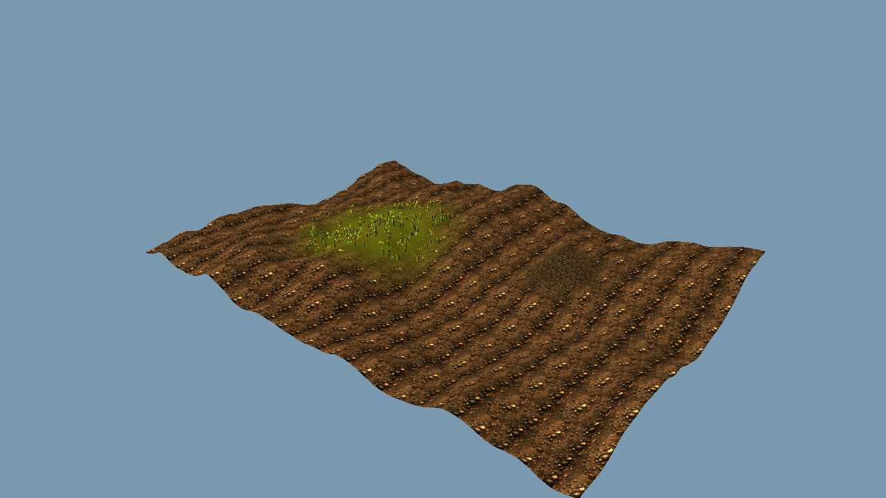
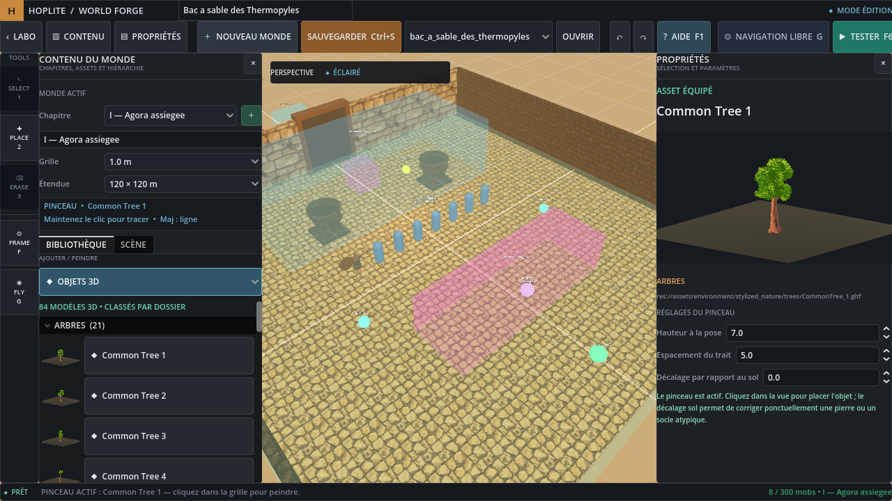

# Forge de mondes Hoplite

Le laboratoire reste la scene principale. Un portail **Forge de mondes** permet d'entrer dans `world_editor.tscn` comme dans un niveau.

## Ce que l'on peut poser et parametrer

- terrains sculptables et redimensionnables par chapitre, avec maillage `ArrayMesh`, collision `HeightMapShape3D`, generation reproductible `FastNoiseLite`, peinture locale multi-materiaux et vegetation `MultiMesh` ;
- sols, murs et blocs, avec dimensions et materiaux de la bibliotheque PBR ;
- tous les modeles GLB/GLTF trouves dans la bibliotheque automatique, ranges dans l'explorateur par categories (arbres, buissons, couvre-sol, rochers, chemins, architecture, decoration, armes et objets) ;
- lumieres omni/spot, couleur, intensite, portee et ombres ;
- troupes ennemies posees comme un bloc de spawn, avec archetype, effectif, taille, rang normal/miniboss et huit formations (ligne, colonne, carre, cercle, coin, phalange, arc et dispersee). Trois unites **Geant — novice / standard / veteran** sont disponibles directement dans la categorie Personnages, a taille 1 par defaut et avec des kits Mutant distincts. Leur traversal est actif par defaut en mode **Assiste** : l'anatomie reste exacte pour les coups et la decapitation, un cylindre lisse et reglable stabilise le wallrun du sol jusqu'aux epaules, puis une enveloppe convexe extraite du vrai mesh de tete suit le crane. Un appui optionnel peut stabiliser le joueur exactement au sommet de cette tete. Le mode **Exact** conserve tous les volumes convexes animes du modele pour diagnostic ;
- preset `PHALANGE 15` compose de 11 lanciers hoplites et 4 lanciers veterans places sur les flancs des deux premieres lignes ;
- comportements normal, attente, patrouille ou protection d'un objet/groupe ;
- routes de patrouille tracees directement sur la carte et cibles a proteger choisies par un clic dans la scene. La position initiale de chaque ennemi ferme automatiquement sa boucle : un unique marqueur produit `depart -> marqueur -> depart`. Apres une poursuite abandonnee, l'ennemi rejoint le point de ronde le plus proche puis reprend son cycle ;
- depart joueur, narration, zones d'atmosphere et declencheurs d'evenements ;
- portes animees en bois, fer, pierre ou bronze, avec ouverture verticale, coulissante a gauche/droite ou pivotante comme une vraie porte ;
- chapitres separes et passages de teleportation vers un point d'arrivee nomme.

## Mode Terrain

La categorie **Terrain — Creer & sculpter** ajoute un heightfield natif a un chapitre. Cinq bases sont fournies : plaine, collines, cretes, vallee et cote. Elles utilisent un seed sauvegarde dans le monde, donc un meme seed avec les memes parametres redonne exactement le meme relief. Dans **Proprietes**, `Largeur X` et `Profondeur Z` permettent de choisir une taille de 8 a 512 metres sans modifier l'echelle verticale.

Agrandir une dimension ne met plus l'ancien terrain a l'echelle : la Forge conserve ses coordonnees physiques, son relief et ses couches peintes, puis genere de nouvelles bandes raccordees sur les cotes. Les objets deja poses gardent donc leur position. En mode **Selection**, quatre poignees sur les bords X/Z permettent de tirer directement un seul cote ; le bord oppose et tout l'ancien relief restent alors fixes dans le monde. Reduire une dimension recadre de la meme maniere. La resolution augmente automatiquement, jusqu'a 129 points par axe, lorsque l'extension a besoin de conserver une finesse proche de l'original.

Le terrain visible et sa collision sont reconstruits depuis le meme tableau de hauteurs : il n'existe pas de decalage entre le sol affiche dans la Forge et le sol utilise par le joueur, l'IA ou les objets en mode test. Les outils sont :

- **Monter** pour elever le relief ;
- **Creuser** pour l'abaisser ;
- **Lisser** pour supprimer les cassures et rendre une pente praticable ;
- **Aplanir** pour rapprocher la zone de la hauteur du premier clic ;
- `Maj` pendant Monter ou Creuser pour inverser temporairement l'operation.

Le rayon et la force du pinceau de modelage sont regroupes dans **Bibliotheque > Terrain**, a cote de Monter, Creuser, Lisser et Aplanir. Ce meme onglet conserve la vegetation MultiMesh et permet de remplacer en un clic la texture de base de tout le terrain. Le dock **Proprietes** conserve uniquement les dimensions, la generation et les reglages persistants du terrain. Un clic-glisse complet cree une seule entree d'historique : `Ctrl+Z` annule donc le trait entier. Changer manuellement la resolution reechantillonne le relief, la peinture et la vegetation existants au lieu de les effacer.

### Peinture locale des textures

Ouvrez **Textures & materiaux**, puis choisissez une texture. Si une surface est selectionnee, elle recoit directement ce materiau. Sinon, la Forge trouve automatiquement le terrain du chapitre, le selectionne et active le pinceau local sans quitter l'onglet Textures. Le rayon, la force, **Peindre** et **Retrouver la base** sont accessibles au-dessus du catalogue : aucun retour dans Terrain n'est necessaire. Le clic-glisse melange la nouvelle texture uniquement sous le pinceau, par-dessus la texture de base et les textures deja peintes. **Retrouver la base** efface progressivement la peinture locale.

Le terrain enregistre maintenant une carte de poids pour toute la palette de materiaux de la Forge. On peut donc employer autant de textures differentes que le catalogue en contient sur un meme terrain ; ajouter une nouvelle texture sur une montagne ne recycle plus un canal global et ne peut plus faire disparaitre une texture peinte ailleurs. Les anciens mondes a trois couches sont migres automatiquement au chargement.

La nouvelle texture `mediterranean_grass` est un sol herbeux olive et sec genere pour l'ambiance mediterraneenne du jeu. Elle est distincte de l'atlas transparent utilise par les meshes d'herbe.

### Vegetation MultiMesh

Le selecteur du pinceau propose **herbe mediterraneenne, herbes hautes, trefles, fleurs sauvages, fougeres, buissons et champignons**. Chaque espece possede sa propre couche de densite : peindre des fleurs sur une zone herbeuse conserve les deux especes au meme endroit. Le rayon et la force/densite se reglent directement a cote du selecteur. Le bouton **Retirer [espece]** efface uniquement l'espece actuellement choisie.

La distribution est reproductible avec le seed de vegetation. La Forge et le jeu creent un `MultiMeshInstance3D` par variante effectivement utilisee, sans noeud par brin, collision, ombre ou contribution GI. Herbes, trefles, fleurs, buissons et champignons melangent maintenant plusieurs variantes de mesh dans des lots distincts. Les fleurs, sous-bois et buissons ne sont plus proposes comme props unitaires dans **Objets 3D** : ils passent par ce pinceau MultiMesh. Godot emet un draw par surface du mesh, la densite des meshes plus lourds est reduite automatiquement et le budget total reste limite a 6000 instances par terrain.

Les 68 meshes du *Stylized Nature MegaKit [Standard]* de Quaternius sont inclus et classes dans `assets/environment/stylized_nature/`. La licence fournie est CC0 1.0 et son texte est conserve dans `assets/environment/stylized_nature/LICENSE_Quaternius_CC0.txt`.



La resolution indique le nombre de points echantillonnes sur chaque axe, independamment des dimensions physiques. Le reglage 65 x 65 est recommande pour l'edition courante. Une resolution plus elevee augmente la taille du JSON et le cout de reconstruction ; au plafond de 129 points, une tres grande extension augmente progressivement l'espacement entre les points.

Un heightfield ne peut pas representer une grotte, un surplomb ou deux hauteurs au meme X/Z. Pour ces formes, combiner le terrain avec les Surfaces et les Objets 3D. Les surfaces restent aussi adaptees aux sols architecturaux parfaitement plans, murs, escaliers provisoires et blocs.

La categorie **Objets 3D** affiche les modeles dans des dossiers repliables par famille. Les arbres/troncs, rochers, chemins et gros decors restent plaçables individuellement ; les buissons et couvre-sols repetitifs sont routes vers le pinceau vegetation MultiMesh. Chaque ligne montre une miniature precalculee. Un clic equipe l'objet et ouvre dans **Proprietes** une grande previsualisation avec hauteur cible, espacement du pinceau, decalage au sol, alignement sur la pente et collision physique.

La production Blender V2 est volontairement separee du reste dans le dossier **BLENDER — PRODUCTION V2**. Ses 92 assets sont ranges dans 14 sous-dossiers (escaliers, ponts, forteresse, armes, machines de siege, etc.) avec leurs apercus. La Forge expose uniquement leur `LOD0` principal et conserve leur hauteur metrique issue du manifeste de production.

Buissons, plantes, fleurs, herbes, sous-bois et tous les elements de **chemin de pierre** sont sans collision de gameplay par defaut, mais restent selectionnables dans la Forge. Les galets `Pebble_*` ont de nouveau un collider. Les objets solides peuvent utiliser une boite, un cylindre, une capsule, une sphere ou une enveloppe convexe simplifiee issue du mesh. Cette derniere suit bien la silhouette exterieure a faible cout, sans reproduire les creux d'un trimesh concave. Les vrais rochers l'utilisent par defaut. Rochers, galets et chemins de pierre alignent automatiquement leur axe vertical sur la normale du terrain afin de suivre les pentes ; ce comportement reste desactivable. Le point d'appui robuste ignore les rares sommets parasites du mesh et le decalage au sol corrige manuellement un asset atypique. Au premier chargement d'une ancienne carte, la Forge remet automatiquement les colliders des galets et retire ceux des routes ; la case reste ensuite modifiable objet par objet.

La categorie **Textures & materiaux** classe les textures en sols naturels, pierre/dalles, murs/architecture et decoratif/special, sans jamais limiter leur usage. Elle inclut sept materiaux PBR CC0 Poly Haven en 1K (albedo, normale OpenGL, rugosite), en plus des textures historiques. Sur une surface selectionnee, choisir une texture l'applique a la selection et au pinceau. Dans tous les autres cas, si le chapitre contient un terrain, ce choix cible ce terrain, garde l'onglet Textures ouvert et equipe automatiquement son pinceau local. La texture globale de base se choisit dans **Terrain > Texture de base — tout le terrain**. Les objets et les surfaces peuvent etre places directement sur le relief, et l'aimantation verticale reconnait egalement la hauteur du terrain.

### Eau, feu, skyboxes et atmosphere globale

La categorie **Lumieres** propose aussi une nappe d'eau horizontale et un feu GPU. L'eau regle sa taille X/Z, ses couleurs, son opacite, ses vagues et une texture facultative prise dans tout le catalogue ; son shader transparent n'utilise pas de refraction ecran. Le feu utilise `GPUParticles3D`, des billboards sans ombre, une simulation a 30 FPS et 8 a 128 particules ; une lumiere omni sans ombre reste facultative.

Le troisieme onglet **Ciel & Atmosphere** pilote l'environnement global : preset, ciel procedural ou panorama HDR, rotation et energie du fond, soleil, ambiance, exposition, saturation, contraste et brouillard detaille. Trois panoramas CC0 Poly Haven 1K sont fournis et la radiance est limitee a 256. Toutes les couleurs ouvrent une roue HSV et restent sauvegardees au format HTML. Un seul `WorldEnvironment` et un seul soleil sont reconstruits, sans dupliquer l'environnement dans la scene.



L'espacement et la distance d'activation sont calcules automatiquement depuis le profil du personnage. Une troupe peut apparaitre au lancement, lorsque le joueur traverse un declencheur choisi sur la carte, apres la mort d'une autre troupe ou apres un timer.

Chaque troupe possede aussi un mode de deploiement :

- `Toute la troupe d'un coup` conserve le fonctionnement classique ;
- `Vagues periodiques` envoie X soldats toutes les X secondes, jusqu'au total maximum, jusqu'a l'evenement d'arret selectionne, ou jusqu'a la premiere mort d'une unite d'une troupe choisie (la troupe de vagues elle-meme peut etre choisie) ;
- `Reserve progressive` separe le total theorique, l'effectif initial, le seuil actif et la taille du lot de renfort. Par exemple 30 / 10 / 7 / 3 affiche 10 soldats, puis en ajoute 3 des qu'il en reste moins de 7, sans jamais depasser 30 soldats deployes au total.

Les mondes de la Forge chargent le meme directeur tactique que le stand de tir. Un lancier hoplite isole passe automatiquement en duel et engage le joueur lorsqu'il entre dans sa distance d'agression, tandis que plusieurs lanciers se structurent en phalange.

Le template **Declencheur** est une hitbox vide, visible uniquement dans la Forge. Il peut rester sans action et servir de zone nommee a un spawn, ou appliquer directement un effet : ouvrir une porte choisie sur la carte, generer/retirer une troupe, retirer tous les ennemis, afficher un message narratif, changer la musique ou appliquer une atmosphere. Les conditions d'event couvrent aussi la mort totale d'un groupe et un pourcentage de pertes. Les templates omni et projecteur se trouvent dans la categorie **Lumieres**.

Une condition de mort est un **evenement global** : la position et la taille de sa box sont ignorees, et le joueur n'a pas besoin de la traverser. Pour afficher un texte, choisir l'action `Afficher une narration`, puis `Message ecrit ici`. Le template `Texte reutilisable` ne se declenche jamais seul ; il sert de contenu partage et doit etre relie depuis cette meme action en choisissant `Element de narration reutilisable`.

## Utilisation

- l'edition est unifiee : surfaces, objets, personnages et elements logiques se selectionnent et se modifient directement, sans mode intermediaire. `Tab` alterne simplement entre les onglets Bibliotheque et Scene ;
- dans **Terrain**, creer ou selectionner le terrain du chapitre, choisir Monter, Creuser, Lisser ou Aplanir, puis maintenir le clic gauche dans la vue. `Maj` inverse Monter/Creuser ;
- **Selection (1)** choisit un element. `Ctrl+clic` ajoute ou retire des elements de la selection ; `Alt+clic-glisse` deplace tout l'ensemble sur le plan et `Maj+clic-glisse` le deplace verticalement. Une surface seule expose six poignees : rouge pour X, verte pour la hauteur et bleue pour Z. Un terrain seul expose quatre poignees laterales rouges/bleues qui prolongent ou recadrent directement le cote tire sans etirer l'ancien relief. Un decor ou une multi-selection sans terrain expose une poignee doree d'echelle uniforme ;
- en mode Selection, `Alt + clic-glisse` deplace directement l'objet, la surface ou la selection sur le plan horizontal. `Maj + clic-glisse` la suit verticalement sans crans. Le sol attire progressivement le point bas de l'element avant le contact, devient vert a l'alignement, puis retrouve sa couleur au relachement ;
- avec une selection, `R` lance sa rotation horizontale autour de Y et `Maj+R` son inclinaison verticale autour de l'axe local X. En multi-selection, chaque orientation tourne autour du pivot propre de son element et toutes les positions restent inchangees. La poignee doree applique de meme l'echelle a chaque element sur place. Bouger la souris regle l'angle, maintenir `Ctrl` l'aimante par pas de 15 degres, clic gauche ou Entree valide, clic droit ou Echap annule. Un anneau et un bandeau nomment toujours l'axe actif ;
- l'onglet **Scene** ouvre un dialogue de nommage quand on cree un groupe, puis permet de le rappeler, de le renommer et d'ajouter ou retirer des membres. **METTRE A JOUR** remplace exactement sa composition par la selection courante, ce qui permet d'ajouter et retirer plusieurs membres en une seule fois. Les groupes d'objets et les groupes d'ennemis sont distincts. En selection simple, la fiche affiche tout en haut chaque groupe du membre ; cliquer son nom selectionne le groupe entier. Ces groupes font partie du document JSON et ne creent aucun noeud supplementaire dans le jeu ;
- la zone de selection des decors est calculee sur leur geometrie visible et placee autour du modele, et non sous celui-ci. Les objets nouvellement poses sont ancres sur le dessus du sol vise ;
- **Pinceau (2)** : choisir une forme, une texture, un objet ou un personnage dans la bibliotheque, puis cliquer dans la vue. Garder le clic gauche enfonce peint en continu. Maintenir `Maj` pendant le trace force une ligne droite ;
- dans **Personnages**, choisir `TROUPE ENNEMIE`, la poser comme n'importe quel objet, puis la selectionner. L'inspecteur adapte immediatement ses commandes au comportement : `Tracer / completer la patrouille` ajoute les points dans l'ordre par clics au sol, puis la position initiale de chaque soldat ferme sa boucle ; `Choisir l'objet ou la troupe` capture directement la cible a proteger ;
- dans **Condition de spawn**, les boutons Carte capturent un declencheur ou une troupe sans saisir d'identifiant. La zone cliquable couvre toute la formation. Les choix de troupe proposent aussi les groupes d'ennemis nommes, y compris pour la protection, les conditions de mort, l'apparition, le retrait et l'arret des vagues. Une mort en pourcentage additionne les effectifs et pertes de toutes les troupes membres ; une action d'apparition ou de retrait s'applique a chacune. Le nom resolu et la reference stable sont affiches sous le champ. Entree, clic droit ou Echap termine/annule une capture ;
- la categorie **Surfaces** contient un constructeur personnalise : choisir Sol, Mur ou Bloc, regler directement X/Y/Z, puis equiper ce pinceau. Les formats 4x4, 4x3 et 2x2x2 restent disponibles comme prereglages ;
- la categorie **Portes & chapitres** propose les quatre styles de porte et les cinq mouvements. Dans un declencheur, choisir l'action `Ouvrir une porte`, puis cliquer directement la porte cible sur la carte ;
- la barre **Chapitre** ouvre un chapitre sans melanger ses objets aux autres et le bouton `+` en cree un vide. Poser un `Point d'arrivee`, lui donner un identifiant, puis poser un `Passage de chapitre` qui vise ce chapitre et cet identifiant ;
- **Taille de la carte** etend la grille de 120 x 120 jusqu'a 1000 x 1000 metres. Les chapitres permettent de construire au-dela sans garder tout le monde en memoire en meme temps ;
- **Gomme (3)** : l'element survole devient rouge et un clic le retire. `Ctrl+Z` reste disponible en cas d'erreur ;
- le pas de grille est reglable entre 0,5 m et 4 m. Placements et redimensionnements y sont aimantes ;
- clic droit + souris : orbiter librement jusque sous l'horizon ; molette : zoom et dezoom etendus ; clic milieu : deplacer la vue ; `F` cadre la selection ;
- ZQSD/WASD : deplacer le centre de la vue ; Suppr : supprimer ; Ctrl+D : dupliquer ;
- `G` ou **Edit fantome** : passe en vue subjective volante sans quitter l'edition. ZQSD/WASD avance et strafe, Espace/E monte, C descend, Maj accelere et le clic droit oriente la vue. La selection, le pinceau, la gomme et l'inspecteur restent utilisables ;
- Ctrl+Z / Ctrl+Y : annuler / retablir ; Ctrl+S : sauvegarder ;
- F6 ou **Tester** : reconstruit tout le chapitre actif et lance le vrai joueur, la vraie IA et les evenements. La selection et la camera ne filtrent jamais les rencontres. Les troupes configurees `Au lancement` apparaissent immediatement ; les conditions zone, mort de groupe et timer restent differees. Echap revient a l'edition.

Les mondes sont sauvegardes dans `user://hoplite_worlds/*.hoplite.json` par remplacement securise, avec l'ancienne version conservee en `.bak`. Chaque sauvegarde cree automatiquement un portail nomme a cote de celui de la Forge dans le laboratoire. Le bouton **SUPPR.** a cote d'**OUVRIR** demande confirmation, supprime le JSON, son `.bak` et son eventuel `.tmp` : le portail associe disparait donc proprement au retour dans le laboratoire. Le document ouvert reste en memoire et peut etre sauvegarde a nouveau. Entrer dans un portail lance le premier chapitre avec le vrai joueur, la vraie IA et les events ; Echap ramene au laboratoire. Lorsqu'un passage change de chapitre, l'ancien runtime est entierement detruit (joueur, ennemis, collisions, timers, Tweens, directeur tactique et events), deux images sont laissees au moteur pour liberer les ressources, puis seul le chapitre de destination est reconstruit. Le compteur en bas additionne aussi les groupes generes plus tard par evenement et avertit a partir de 300 ennemis par chapitre par defaut.

L'interface reprend maintenant l'organisation d'un logiciel 3D professionnel : barre d'application et de commandes, palette d'outils verticale permanente, navigateur de **Contenu** avec les onglets **Bibliotheque**, **Scene** et **Ciel & Atmosphere**, dock **Proprietes**, indicateur de vue et barre d'etat. Les commandes temporaires du terrain restent dans la Bibliotheque ; Proprietes sert aux donnees persistantes de la selection ou a la fiche agrandie d'un asset equipe. Les boutons `CONTENU` et `PROPRIETES` de la barre superieure, ainsi que les croix des docks, permettent de masquer ou de rouvrir independamment les deux panneaux pour liberer la vue 3D.

Le bouton **AIDE** ou `F1` ouvre un centre de documentation integre organise comme un wiki. Il contient une recherche plein texte, un parcours guide en sept etapes, des articles sur chaque famille de fonctionnalites et une reference des commandes. La page **Raccourcis personnalisables** permet de remplacer les touches principales et secondaires, bloque les conflits et repercute immediatement les nouveaux libelles dans l'interface. Les preferences sont sauvegardees dans `user://hoplite_worlds/editor_shortcuts.json` et peuvent etre reinitialisees individuellement ou globalement.

## Format

Le document JSON est versionne (`version: 10`) et separe les chapitres, les entites, leurs transformations, leurs proprietes et les groupes d'edition (`editor_groups`). Les hauteurs, dimensions, palette et poids de materiaux, ainsi que sept couches locales de vegetation (`foliage_layers`), sont conserves dans les proprietes de l'entite `terrain`, ce qui les rend compatibles avec sauvegarde, chargement, redimensionnement, duplication et historique. Les anciens terrains a trois canaux sont migres vers la palette complete ; les anciennes cartes `foliage_density` + `foliage_types` sont migrees automatiquement vers les couches de vegetation. Les decors peuvent enregistrer `collision_enabled`, `collision_shape` et `align_to_ground`. La version 10 introduit la palette de peinture terrain complete ; la version 9 avait complete les reglages d'atmosphere et ajoute les entites `water` et `fire`. Les fichiers principaux sont :

- `scripts/world_editor/world_document.gd` : schema, validation, sauvegarde et garde-fous ;
- `scripts/world_editor/world_terrain.gd` : generation, maillage, collision, sculpture et echantillonnage du relief ;
- `scripts/world_editor/world_terrain_foliage.gd` : distribution deterministe et rendu MultiMesh de la vegetation ;
- `scripts/environment/terrain_layer_blend.gdshader` : melange triplanaire de la base et des poids peints pour toute la palette ;
- `scripts/world_editor/world_runtime.gd` : construction 3D du chapitre et apercu d'edition ;
- `scripts/world_editor/world_event_runtime.gd` : conditions et actions d'evenements ;
- `scripts/world_editor/world_editor_grid.gd` : grille 3D et axes Blender ;
- `scripts/world_editor/world_editor.gd` : interface, inspecteur, selection et historique.

Validation headless du terrain :

```powershell
Godot_v4.7-stable_win64_console.exe --headless --path . --script tools/world_terrain_probe.gd
```
