# Catalogue des assets d'environnement

Ce document est la source de vérité pour `_source/environment_props_raw`. Il décrit ce que représente réellement chaque fichier, son échelle de jeu, son placement et sa stratégie de performance. Le registre exécutable correspondant est `scripts/environment/environment_asset_catalog.gd`.

Dernier audit visuel et technique : 22 août 2026. État attendu : **13 dossiers d'objets et 13 textures, tous catalogués**.

## Objets 3D

Les GLB ont presque tous été exportés dans une boîte normalisée proche de 1 × 1 × 1. Leur taille brute ne représente donc pas des mètres. La colonne « hauteur jeu » est la référence appliquée par le générateur.

| ID du registre | Source / identité visuelle vérifiée | Coût LOD0 | Hauteur jeu | Usage et assemblage | Collision / LOD runtime |
|---|---|---:|---:|---|---|
| `big_rock` | `bigRock` — amas de ruines monumentales, colonnes brisées et maçonnerie. Ce n'est pas un rocher ordinaire. | 19 990 tris | 4,2 m | Landmark rare sur un flanc du champ de siège ou ruine urbaine. Ne pas disperser comme caillou. | Boîte basse 4,4 × 2,2 × 4,4 m. LOD0 héros, LOD1 répétition/lointain. |
| `brazier` | `brazier` — grand chaudron ornemental sur pieds de lion. | 3 964 tris | 2,35 m | Toujours près d'une porte, d'un autel ou d'un dais, de préférence par paire. Le générateur ajoute flamme et lumière. | Cylindre limité au socle. LOD1 en répétition. |
| `crates` | `caisse/caisses` — pile déjà composée de trois caisses avec bouteilles et débris. | 4 000 tris | 1,85 m | Dépôt, marché ou batterie de siège, contre un mur. À associer aux jarres, jamais au centre d'une voie. | Boîte simple. Un seul LOD disponible. |
| `catapult` | `catapulte` — machine de siège complète sur roues. | 9 983 tris | 4,1 m | Batteries de deux ou trois, toutes orientées vers la muraille, accompagnées de ravitaillement. | Boîte proxy basse. Un seul LOD disponible, donc quantité faible. |
| `cypress_tree` | `cypressTree` — cyprès élancé sur petit socle de pierre. | 3 998 tris | 7,2 m | Alignements d'avenue, cours et limites latérales. Laisser les axes de combat libres. | Petit cylindre sur le tronc/socle. LOD1 répété. |
| `fountain` | `fontaine1` — fontaine grecque monumentale circulaire. | 9 996 tris | 3,45 m | Une seule pièce centrale dans l'agora ; elle structure le flux autour de la place. | Cylindre sur la vasque basse. LOD0 héros. |
| `jar` | `jare` — amphore haute et décorée sur socle. | 3 000 tris | 1,35 m | Paires ou petits groupes avec les caisses, contre le décor. | Pas de collision pour éviter les accrochages de foule. |
| `barricade` | `obstacle` — barricade de pieux, bois, crâne et ossements sur base carrée. | 14 866 tris | 2,15 m | **Modules côte à côte**, espacés de 2,08 m. Former des lignes ou demi-lignes avec une brèche centrale jouable ; jamais en exemplaires isolés aléatoires. | Boîte étroite 2,18 × 1,35 × 1,15 m. Un seul LOD : limiter les longues lignes. |
| `athena_statue` | `statusAthena` — Athena debout, lance et bouclier, sur piédestal. | 25 730 tris | 6,4 m | Repère civique ; paire symétrique à l'agora ou devant le temple. | Collision limitée au piédestal. LOD0 héros, LOD1 en paire secondaire. |
| `lion_statue` | `statusLion` — lion assis sur large piédestal avec débris. | 5 949 tris | 3,15 m | Paire symétrique gardant une porte, un escalier ou le dais du boss. | Boîte sur le socle. LOD1 en paire. |
| `magistrate_statue` | `statusMagistrale` — magistrat barbu assis sur un trône, avec bannières et symboles macabres. | 39 786 tris | 6,1 m | Landmark unique derrière NFullArmor, comme ancien trône/tribunal. La face avant native regarde vers +Z : dans le donjon, yaw 0° pour faire face au joueur. | Boîte limitée au trône. LOD0 unique uniquement. |
| `temple` | `temple1` — bâtiment complet à colonnes et toit, endommagé, avec bannières. | 29 929 tris | 10,5–11,5 m | Silhouette architecturale majeure de l'acropole ou fond de salle du trône. Hors de l'axe jouable : ce n'est pas un petit prop. | Pas de collision dans la campagne ; LOD1 comme arrière-plan. |
| `tomb` | `tombe1` — tombeau/mausolée sculpté, ossements et lueur rouge. | 3 946 tris | 2,2 m | Rangées régulières dans les bas-côtés de la crypte pour former des couloirs. | Boîte proxy. LOD1 répété. |

### Planches visuelles

| | | |
|---|---|---|
| 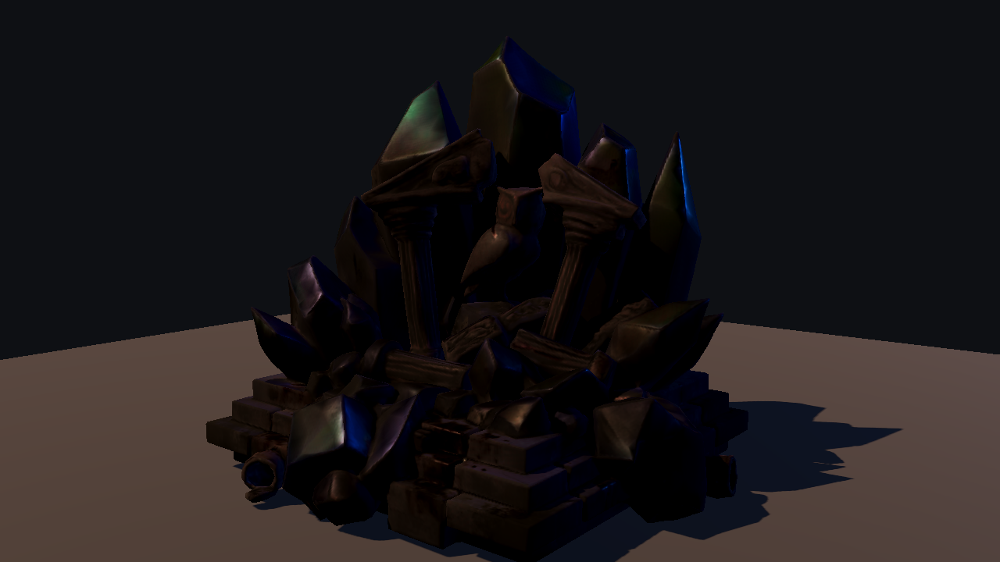 | 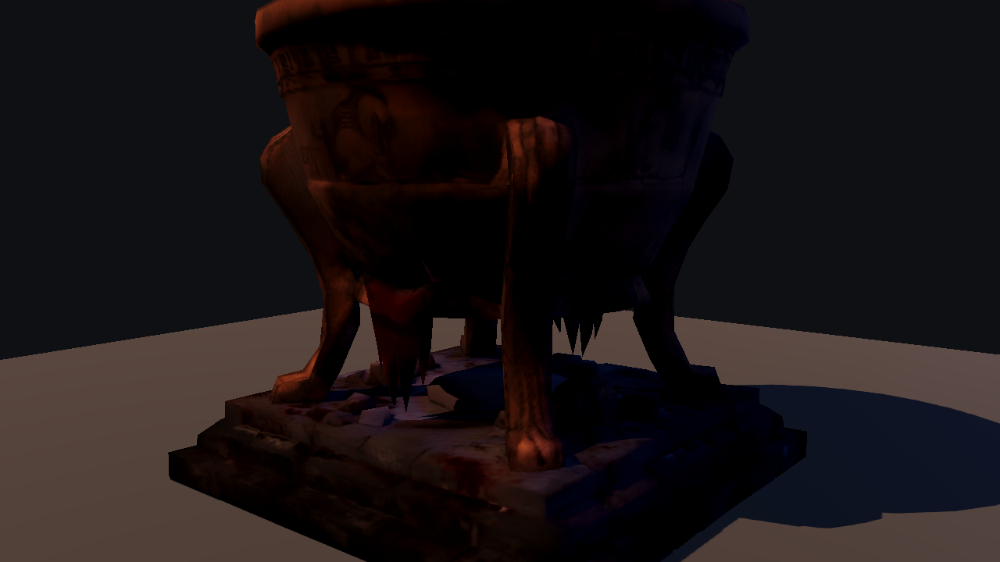 | 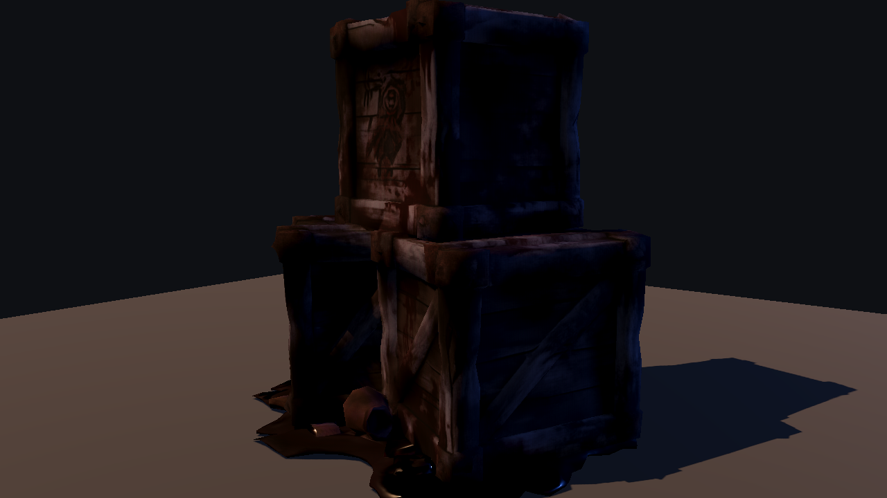 |
| 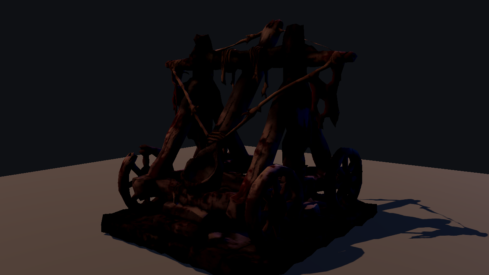 | 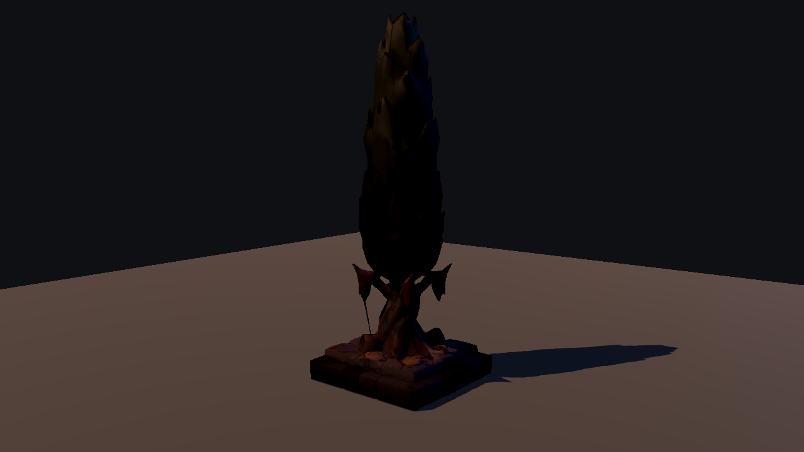 | 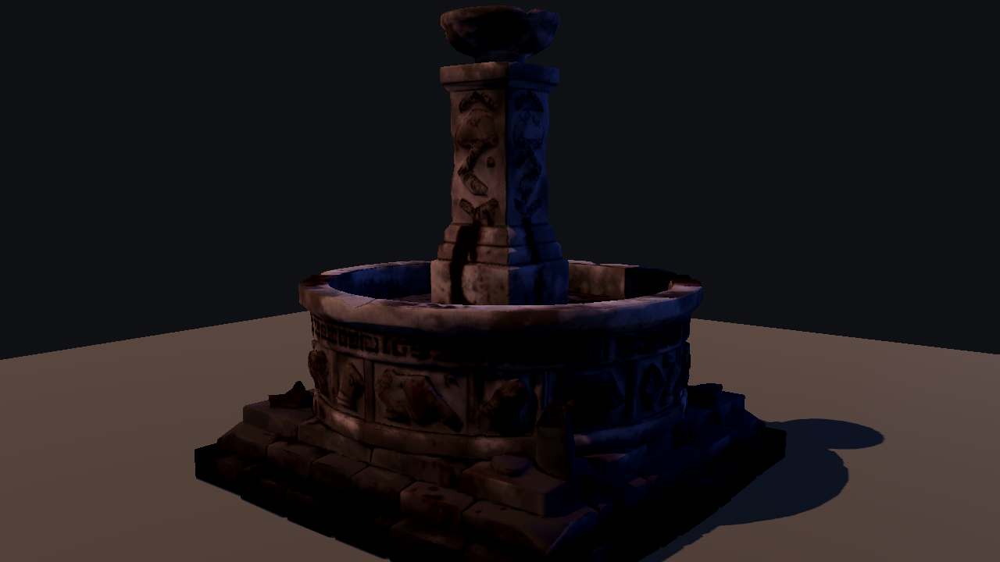 |
| 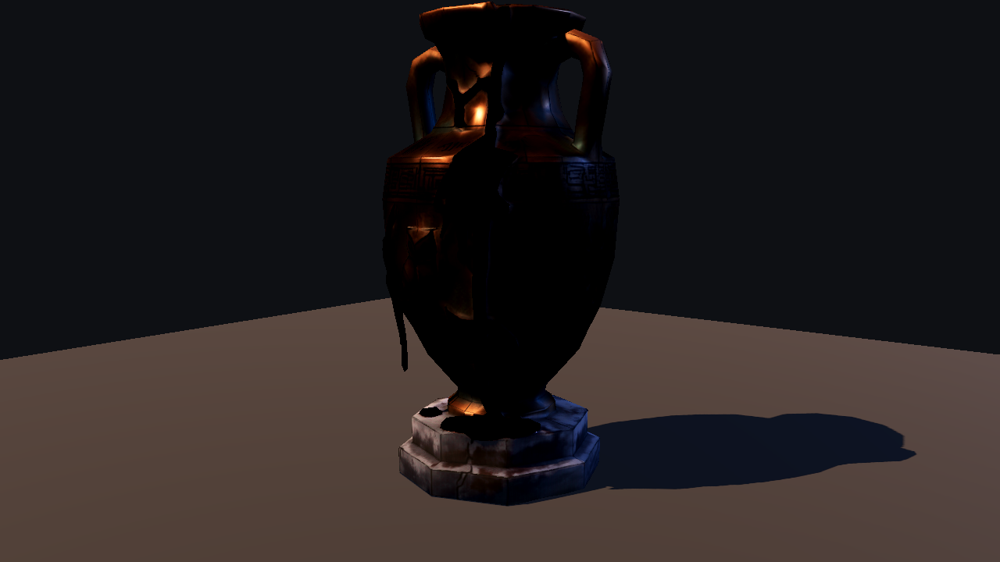 | 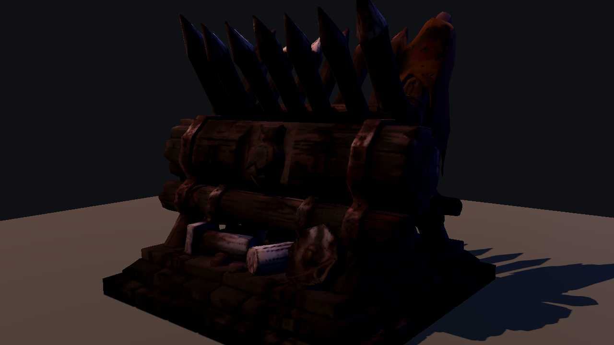 | 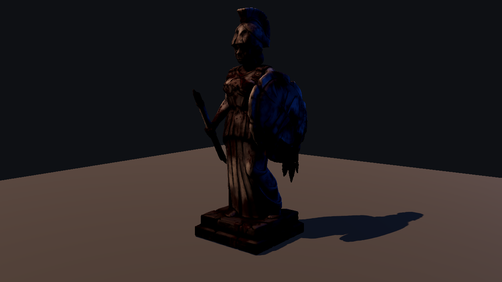 |
| 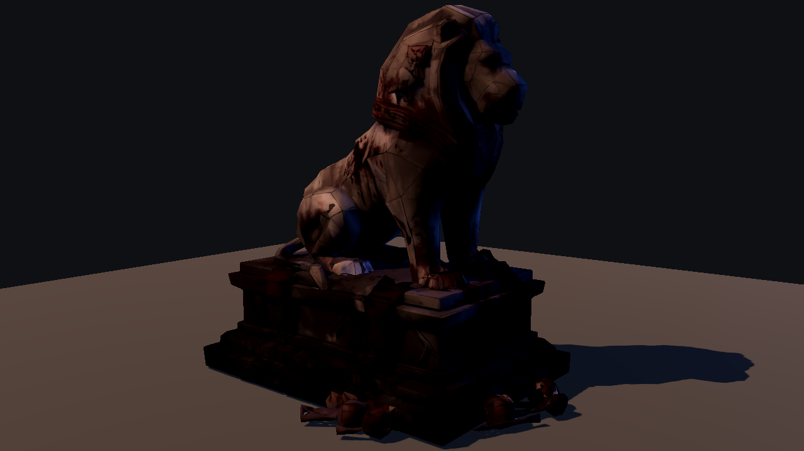 | 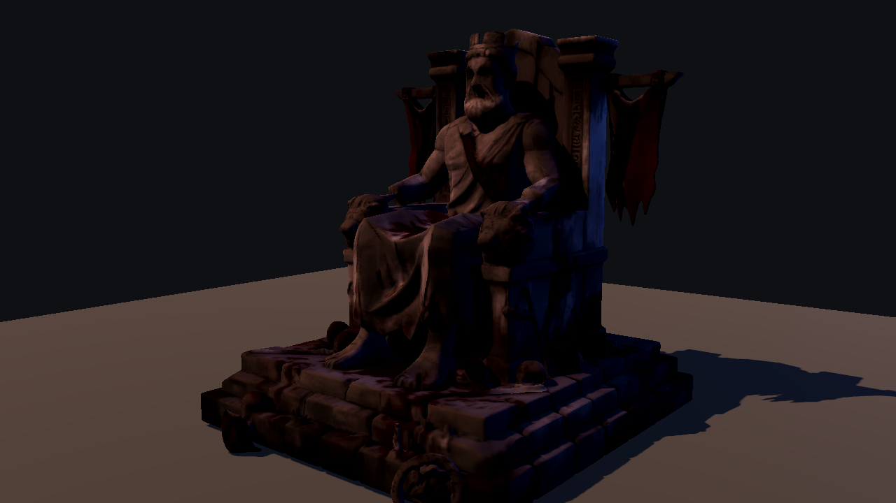 | 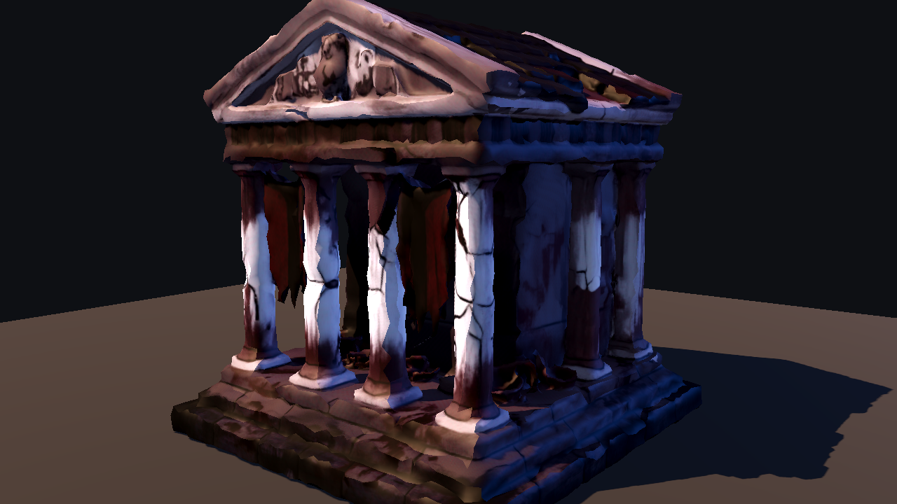 |
| 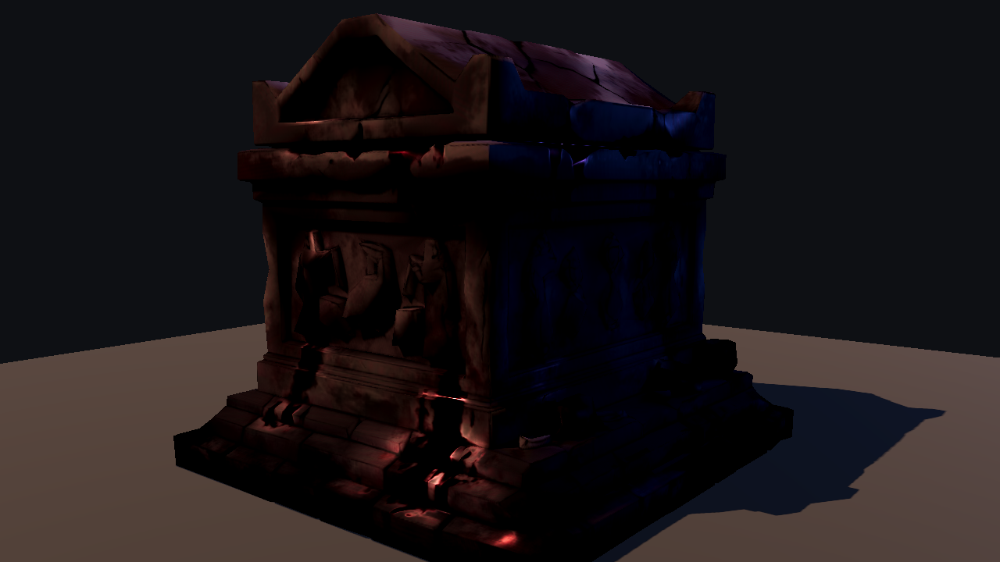 | | |

## Textures

Toutes les images sources font 2048 px. Le chargeur runtime les partage entre les matériaux, les réduit à 1024 px maximum et génère les mipmaps. Cela évite de dupliquer treize textures 2K dans chaque bloc procédural.

| Fichier / style | Ce que l'image représente | Projection correcte | Usage retenu |
|---|---|---|---|
| `Dusty_dirt_path...` / `dirt_path` | Terre sombre, traces de roues/pas, pierres et tessons | Triplanaire au sol | Sol principal de l'assaut des murailles. |
| `Scorched_grass_and_bone...` / `scorched_ground` | Terre brûlée, herbe sèche, os et fragments de colonne | Triplanaire au sol, plaques irrégulières | Zones bombardées du siège, jamais tout le terrain. |
| `Patchy_weeds_on_cracked_earth...` / `cracked_weeds` | Terre fissurée avec végétation clairsemée | Triplanaire au sol | Marges extérieures et jardins abandonnés. |
| `Game_texture_with_gravel_rocks...` / `bone_gravel` | Gravier très sombre avec crânes et squelettes | Triplanaire au sol | Parvis macabre et couloir central de la crypte. |
| `Limestone_pavers...` / `pavers` | Pavés calcaires chauds et irréguliers | Triplanaire au sol | Rues générales de la ville. |
| `Sandstone_floor_blocks...` / `sandstone_floor` | Dalles de grès dorées | Triplanaire au sol | Route processionnelle, cours et toits plats. |
| `White_marble_floor...` / `white_marble_floor` | Dalles blanches avec éclats et sang | Triplanaire au sol | Agora et dais de NFullArmor, réservés aux zones importantes. |
| `Limestone_brick_wall...` / `limestone_brick` | Blocs calcaires propres | Triplanaire sur volume | Maisons et quartiers civils. |
| `Limestone_fortress_wall...` / `fortress` | Blocs de forteresse salis et ensanglantés | Triplanaire sur volume | Remparts, porte et enceinte urbaine. |
| `Rough_stone_wall...` / `rough_stone` | Pierres très sombres et grossières | Triplanaire sur volume | Falaises artificielles, crypte et murs du donjon. |
| `Marble_wall...` / `marble` | Blocs de marbre civiques, fissurés et tachés | Triplanaire sur volume | Linteaux, créneaux et éléments nobles dégradés. |
| `Stone_wall...` / `ornate_stone_wall` | Mur bleu-noir avec frise grecque horizontale | **Panneau UV vertical** | Panneaux latéraux du donjon. Ne pas projeter au sol ni en triplanaire : la frise perdrait son orientation. |
| `Ancient_Greek_mural...` / `mural` | Fresque narrative grecque bleue, fissurée et ensanglantée | **Panneau UV vertical** | Deux ou trois panneaux héros en ville et dans la salle du trône ; usage rare pour éviter la répétition. |

## Règles de composition actuelles

| Murailles | Ville | Donjon |
|---|---|---|
| 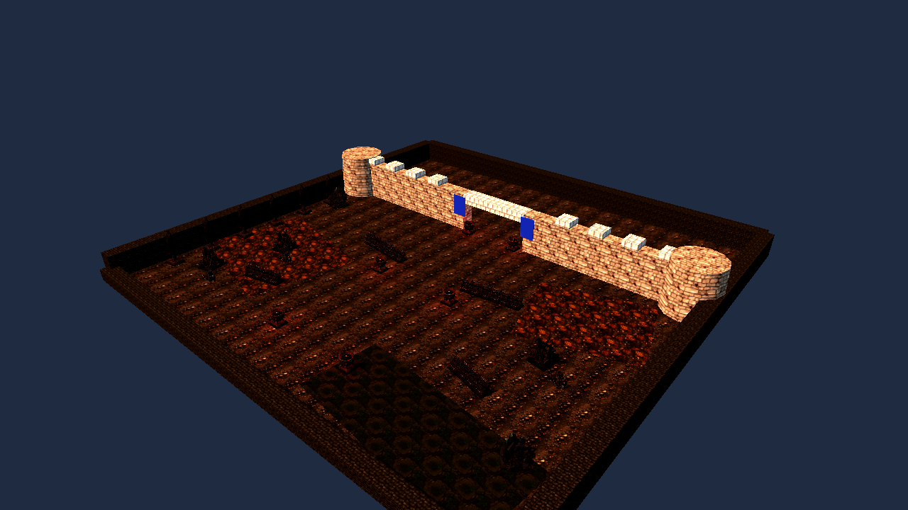 | 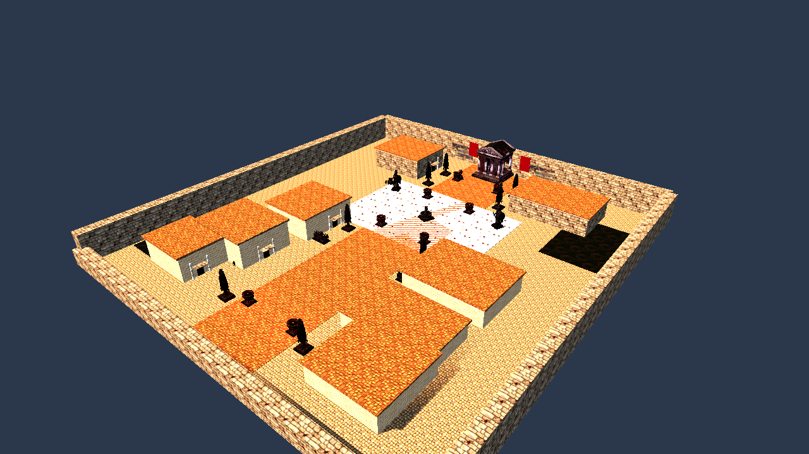 | 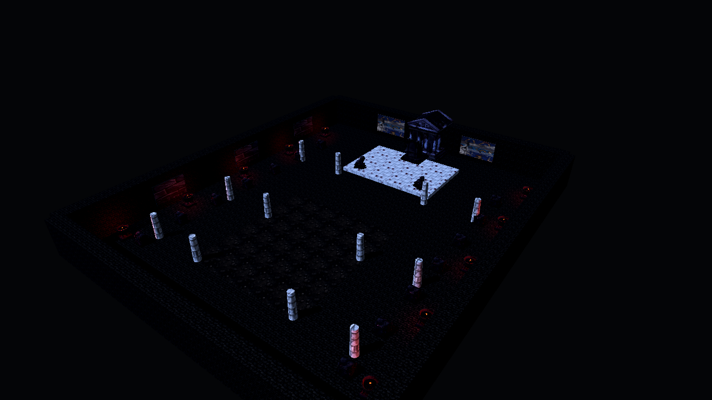 |

Chaque acte dispose de trois macro-variantes (`v0`, `v1`, `v2`) conservées dans le dossier `zones/`. Elles changent les lignes défensives et batteries de siège, la position de l'agora et les parcelles urbaines, puis la colonnade et le dessin des tombeaux. Les dimensions, rotations et détails restent ensuite modulés par la graine.

- Murailles : terrain extérieur en terre, plaques brûlées/végétalisées, batteries de catapultes ravitaillées, quatre lignes de barricades modulaires, ruines monumentales rares, cyprès latéraux et braseros à la porte.
- Ville : rue centrale en grès, maisons calcaires, agora en marbre blanc, fontaine unique, Athena en paire, lions devant l'acropole, marchés contre les bâtiments et fresques sur le mur final.
- Donjon : pierre sombre, gravier d'ossements, tombeaux en rangées, panneaux grecs orientés, braseros réels, lions gardant le dais, temple et magistrat comme fond de boss.

Les trois cartes ont un périmètre de collision invisible sur leurs quatre côtés. Le directeur de foule contrôle en plus les positions toutes les 0,35 seconde et replace toute unité passée sous le sol ou hors des limites sûres.

La collision repose sur des primitives très simples, pas sur les maillages `_collision.glb` de 124 triangles. Ces derniers restent utiles comme référence, mais les proxies évitent de multiplier les tests complexes avec 42 ennemis simultanés.

## Ajouter de nouveaux assets

1. Déposer le nouveau dossier GLB ou la texture dans `_source/environment_props_raw` sans renommer les fichiers existants.
2. Exécuter le contrôle :

   `Godot_v4.7-stable_win64_console.exe --headless --path . --script res://tools/environment_catalog_check.gd`

   Toute entrée sous `NEW ASSET FOLDERS` ou `NEW TEXTURES` n'est pas encore prise en compte.
3. Pour un objet, l'ajouter aux listes de `tools/environment_asset_audit.gd` et `tools/environment_asset_thumbnailer.gd`, puis examiner silhouette, face avant, socle, taille relative, coût LOD0/LOD1 et collision.
4. Ajouter sa fiche dans `environment_asset_catalog.gd` avec `hero`, `repeat`, `target_height`, collision, zones et règle de placement. Mettre cette page à jour avec la miniature.
5. Pour une texture, décrire son sens visuel avant de choisir la projection. Une image directionnelle (fresque, frise, porte) doit rester sur un panneau UV ; un matériau sans direction forte peut être triplanaire.
6. Ajouter l'asset à un assemblage sémantique du générateur. Éviter les tirages aléatoires génériques : une caisse appartient à un dépôt, une catapulte à une batterie, une statue à un axe symétrique.
7. Relancer `tools/procedural_campaign_probe.gd` et une capture visuelle des trois actes.

Le contrôle sort avec le code `0` uniquement lorsque le disque et les deux registres concordent. Il détecte également les éléments catalogués qui auraient été supprimés ou déplacés.
